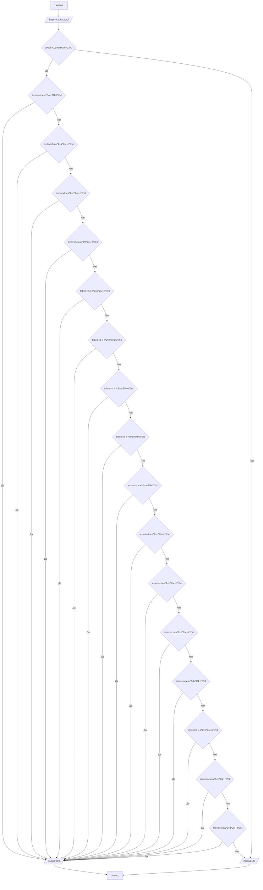

## Cодержание

1. [Отчет по лабораторной работе № N](#отчет-по-лабораторной-работе--n)
2. [Критерии оценивания](#критерии-оценивания)

## Отчет по лабораторной работе № 1

#### № группы: ` ПМ-2401`

#### Выполнил: `Воеводина Дарья Андреевна`

#### Вариант: `5`

### Cодержание:

- [Постановка задачи](#1-постановка-задачи)
- [Входные и выходные данные](#2-входные-и-выходные-данные)
- [Математическая модель](#25-математическая-модель)
- [Выбор структуры данных](#3-выбор-структуры-данных)
- [Алгоритм](#4-алгоритм)
- [Программа](#5-программа)
- [Анализ правильности решения](#6-анализ-правильности-решения)

### 1. Постановка задачи

- Условия задачи

> На вход программы подаются шесть натуральных чисел — все возможные
расстояния между четырьмя точками на плоскости. Определить, являются
ли эти 4 точки вершинами ромба ("YES"/"NO").

- Для выполнения этой задачи, нужно рассмотреть все условия того, что фигура ромб:
  -все стороны равны
  -диагонали точкой пересечения делятся пополам и перпендмкулярны
Нужно рассмотреть выполняются ли эти условия одновременно
Всего необходимо рассмотреть 15 вариантов (Сочетание из 6 по 2, так как 6 переменных и из них млжно выбрать 2 переменные под диагонали)

### 2. Входные и выходные данные

#### Данные на вход
В задаче указано, что вход подается 6 натуральных чисел, являющихся расстояниями
Максимальная граница не указана. Поэтому возьмём произвольную - 1000.
А минимальные граница всех чисел, таким образом, является число 1
|             | Тип                       | min значение    | max значение   |
|-------------|---------------------------|-----------------|----------------|
|   (Число 1) | Целое(натуральное) число  |        1        |     1000       |
|   (Число 2) | Целое(натуральное) число  |        1        |     1000       |
|   (Число 3) | Целое(натуральное) число  |        1        |     1000       |
|   (Число 4) | Целое(натуральное) число  |        1        |     1000       |
|   (Число 5) | Целое(натуральное) число  |        1        |     1000       |
|   (Число 6) | Целое(натуральное) число  |        1        |     1000       |

#### Данные на выход
На выходе мы получаем ответ на вопрос, являются ли 4 точки вершинами ромба, то есть вывод это строка
|          | Тип                                | Значение   |
|----------|------------------------------------|------------|
| Строка 1 | Строка                             | YES/NO     |

### 2,5. Математическая модель

Свойства ромба: 
1) Все стороны ромба равны (a=b=c=d, где a,b,c,d - стороны ромба)
2) Диагонали ромба перпендикулярны, точкой пересечения делятся пополам(a^2=(e/2)^2+(f/2)^2, где a-сторона ромба, а e,f - его диагонали)


### 3. Выбор структуры данных

Программа получает 6 целых, натуральных чисел
|             | название переменной | Тип (в Java) |
|-------------|---------------------|--------------|
|   (Число 1) | `a`                 |    `int`     |
|   (Число 2) | `b`                 |    `int`     |
|   (Число 3) | `c`                 |    `int`     |
|   (Число 4) | `d`                 |    `int`     |
|   (Число 5) | `e`                 |    `int`     |
|   (Число 6) | `f`                 |    `int`     |
Выходные данные - строка,которую не обязательно хранить в отдельной переменной

### 4. Алгоритм

#### Алгоритм выполнения программы:
1. **Ввод данных**
   Программа считывает шесть целых чисел,обозначенных как 'a','b',''c','d','e','f'
2. **Проверка, на то являются ли введенные числа натуральными**
    Программа, проверяет являются ли числа натуральными, если да, то проверяет условия того, что 4 точки - вершины ромба, иначе выводит  NO
   3. **Проверка свойств ромба**
   -Программа проверяет, равны ли значаения сторон a,b,c,d и сумма квадратов полвин диагоналей f,e равна этой стороне в квадрате
   -Программа проверяет, равны ли значаения сторон e,f,c,d и сумма квадратов полвин диагоналей a,b равна этой стороне в квадрате
   -Программа проверяет, равны ли значаения сторон a,b,e,f и сумма квадратов полвин диагоналей c,d равна этой стороне в квадрате
   -Программа проверяет, равны ли значаения сторон a,b,c,e и сумма квадратов полвин диагоналей f,d равна этой стороне в квадрате
   -Программа проверяет, равны ли значаения сторон e,b,c,f и сумма квадратов полвин диагоналей a,d равна этой стороне в квадрате
   -Программа проверяет, равны ли значаения сторон e,b,f,d и сумма квадратов полвин диагоналей a,c равна этой стороне в квадрате
   -Программа проверяет, равны ли значаения сторон f,b,c,d и сумма квадратов полвин диагоналей a,e равна этой стороне в квадрате
   -Программа проверяет, равны ли значаения сторон e,b,c,d и сумма квадратов полвин диагоналей f.a равна этой стороне в квадрате
   -Программа проверяет, равны ли значаения сторон a,e,f,d и сумма квадратов полвин диагоналей b,c равна этой стороне в квадрате
   -Программа проверяет, равны ли значаения сторон a,e,c,f и сумма квадратов полвин диагоналей b,d равна этой стороне в квадрате
   -Программа проверяет, равны ли значаения сторон a,f,c,d и сумма квадратов полвин диагоналей b,e равна этой стороне в квадрате
   -Программа проверяет, равны ли значаения сторон a,e,c,d и сумма квадратов полвин диагоналей f,b равна этой стороне в квадрате
   -Программа проверяет, равны ли значаения сторон a,b,f,d и сумма квадратов полвин диагоналей c,e равна этой стороне в квадрате
   -Программа проверяет, равны ли значаения сторон a,b,e,d и сумма квадратов полвин диагоналей f,c равна этой стороне в квадрате
   -Программа проверяет, равны ли значаения сторон a,b,c,f и сумма квадратов полвин диагоналей e,d равна этой стороне в квадрате
4. **Вывод результата**
   На экран выводится ответ,являются ли вершины,соединенные данными прямыми вершинами ромба
```markdown
    ```mermaid
         A[Начало] -->B[/Ввести: a,b,c,d,e,f/]
    B --> C{a>0,b>0,c>0,d>0,e>0,f>0}
    C --> |Да| D{a=b=c=d и a^2=e^2/4+f^2/4}
    C --> |Нет| U[Вывод:/NO/]
    D --> |Да| E[/Вывод:YES/]
    D --> |Нет| F{c=d=e=f и e^2=a^2/4+b^2/4}
    F --> |Да| E[/Вывод:YES/]
    F --> |Нет| G{a=b=e=f и a^2=c^2/4+d^2/4}
    G --> |Да| E[/Вывод:YES/]
    G --> |Нет| H{a=b=e=c и a^2=f^2/4+d^2/4}
    H --> |Да| E[/Вывод:YES/]
    H --> |Нет| I{f=b=e=c и e^2=a^2/4+d^2/4}
    I --> |Да| E[/Вывод:YES/]
    I --> |Нет| J{f=b=e=d и e^2=a^2/4+c^2/4}
    J --> |Да| E[/Вывод:YES/]
    J --> |Нет| K{f=b=c=d и f^2=a^2/4+e^2/4}
    K --> |Да| E[/Вывод:YES/]
    K --> |Нет| L{f=b=c=d и f^2=a^2/4+e^2/4}
    L --> |Да| E[/Вывод:YES/]
    L --> |Нет| M{e=b=c=d и e^2=a^2/4+f^2/4}
    M --> |Да| E[/Вывод:YES/]
    M --> |Нет| N{e=a=f=d и e^2=b^2/4+c^2/4}
    N --> |Да| E[/Вывод:YES/]
    N --> |Нет| O{e=a=f=c и e^2=b^2/4+d^2/4}
    O --> |Да| E[/Вывод:YES/]
    O --> |Нет| P{d=a=f=c и a^2=b^2/4+e^2/4}
    P --> |Да| E[/Вывод:YES/]
    P --> |Нет| R{d=a=e=c и a^2=b^2/4+f^2/4}
    R --> |Да| E[/Вывод:YES/]
    R --> |Нет| Q{d=a=b=f и a^2=c^2/4+e^2/4}
    Q --> |Да| E[/Вывод:YES/]
    Q --> |Нет| S{d=a=b=e и a^2=c^2/4+f^2/4}
    S --> |Да| E[/Вывод:YES/]
    S --> |Нет| T{f=a=b=c и a^2=d^2/4+e^2/4}
    T --> |Да| E[/Вывод:YES/]
    T --> |Нет| U[/Вывод:NO/]
    E --> V[Конец]
    U --> V[Конец]


    ``` 
```





### 5. Программа

Полный текст программы с комментариями на русском языке

Нужно вставить код прямо в отчет в блок:

```markdown
    ```java
          import java.io.PrintStream;
import java.util.Scanner;
public class Main {
public static Scanner in = new Scanner(System.in);
public static PrintStream out = System.out;

    public static void main(String[] args) {
        //Считываем шесть целых чисел a,b,c,d,e,f с консоли
        int a = in.nextInt();
        int b = in.nextInt();
        int c = in.nextInt();
        int d = in.nextInt();
        int e = in.nextInt();
        int f = in.nextInt();
         //Проверяем являются ли числа натуральными
        if (a>0&&b>0&&c>0&&d>0&&e>0&&f>0) {
            //Проверяем выполняются ли свойства ромба для введенных чисел
            if ((a == b && a == c && a == d) && (Math.pow(e / 2, 2) + Math.pow(f / 2, 2) == Math.pow(a, 2))) {
                //Если все свойства выполняются,когда диагонали e,f, то выводим ответ YES
                out.print("YES");
            }
            else {
                if ((e == b && e == c && e == f) && (Math.pow(a / 2, 2) + Math.pow(b / 2, 2) == Math.pow(e, 2))) {
                    //Если все свойства выполняются,когда диагонали a,b, то выводим ответ YES
                    out.print("YES");
                }
                else {
                    if ((a == b && a == e && a == f) && (Math.pow(c / 2, 2) + Math.pow(d / 2, 2) == Math.pow(a, 2))) {
                        //Если все свойства выполняются,когда диагонали d,c, то выводим ответ YES
                        out.print("YES");
                    }
                    else {
                        if ((a == b && a == c && a == e) && (Math.pow(d / 2, 2) + Math.pow(f / 2, 2) == Math.pow(a, 2))) {
                            //Если все свойства выполняются,когда диагонали d,f, то выводим ответ YES
                            out.print("YES");
                        }
                        else {
                            if ((e == b && e == c && e == f) && (Math.pow(a / 2, 2) + Math.pow(d / 2, 2) == Math.pow(e, 2))) {
                                //Если все свойства выполняются, когда диагонали a,d,то выводим ответ YES
                                out.print("YES");
                            }
                            else {
                                if ((e == b && e == f && e == d) && (Math.pow(a / 2, 2) + Math.pow(c / 2, 2) == Math.pow(e, 2))) {
                                    //Если все свойства выполняются,когда диагонали a,c, то выводим ответ YES
                                    out.print("YES");
                                }
                                else {
                                    if ((f == b && f == c && f == d) && (Math.pow(a / 2, 2) + Math.pow(e / 2, 2) == Math.pow(f, 2))) {
                                        //Если все свойства выполняются,когда диагонали a,e, то выводим ответ YES
                                        out.print("YES");
                                    }
                                    else {
                                        if ((e == b && e == c && e == d) && (Math.pow(a / 2, 2) + Math.pow(f / 2, 2) == Math.pow(e, 2))) {
                                            //Если все свойства выполняются, когда диагонали a,f,то выводим ответ YES
                                            out.print("YES");
                                        }
                                        else {
                                            if ((a == e && a == f && a == d) && (Math.pow(c / 2, 2) + Math.pow(b / 2, 2) == Math.pow(a, 2))) {
                                                //Если все свойства выполняются,когда диагонали c,b , то выводим ответ YES
                                                out.print("YES");
                                            }
                                            else {
                                                if ((a == e && a == c && a == f) && (Math.pow(b / 2, 2) + Math.pow(d / 2, 2) == Math.pow(a, 2))) {
                                                    //Если все свойства выполняются,когда диагонали b,d, то выводим ответ YES
                                                    out.print("YES");
                                                }
                                                else {
                                                    if ((a == f && a == c && a == d) && (Math.pow(e / 2, 2) + Math.pow(b / 2, 2) == Math.pow(a, 2))) {
                                                        //Если все свойства выполняются,когда диагонали b,e, то выводим ответ YES
                                                        out.print("YES");
                                                    }
                                                    else {
                                                        if ((a == e && a == c && a == d) && (Math.pow(b / 2, 2) + Math.pow(f / 2, 2) == Math.pow(a, 2))) {
                                                            //Если все свойства выполняются, когда диагонали b,f,то выводим ответ YES
                                                            out.print("YES");
                                                        }
                                                        else {
                                                            if ((a == b && a == f && a == d) && (Math.pow(e / 2, 2) + Math.pow(e / 2, 2) == Math.pow(a, 2))) {
                                                                //Если все свойства выполняются,когда диагонали e,c, то выводим ответ YES
                                                                out.print("YES");
                                                            }
                                                            else {
                                                                if ((a == b && a == e && a == d) && (Math.pow(c / 2, 2) + Math.pow(f / 2, 2) == Math.pow(a, 2))) {
                                                                    //Если все свойства выполняются,когда диагонали c,f , то выводим ответ YES
                                                                    out.print("YES");
                                                                }
                                                                else {
                                                                    if ((a == b && a == c && a == f) && (Math.pow(e / 2, 2) + Math.pow(d / 2, 2) == Math.pow(a, 2))) {
                                                                        //Если все свойства выполняются,когда диагонали d,e , то выводим ответ YES
                                                                        out.print("YES");
                                                                    }
                                                                    else {
                                                                        out.print("NO");
                                                                        }
                                                                    }
                                                                }
                                                            }
                                                        }
                                                    }
                                                }
                                            }
                                        }
                                    }
                                }
                            }

                        }

                    }
                }
            }
        }
        else {
            //Если введенные числа не являются натуральными,то у нас не моежт быть ромба
            out.print("NO");
        }
    }
}
    ``` 
```

Это будет выглядеть следующим образом:

```java
class Main{
    // Что-то далее
}
```

### 6. Анализ правильности решения

Привести тесты и анализ работы программы для этих тестов.
Очень неплохо было бы обосновать выбор тестов.

1. Тест на правильность работы программы

   - Input:
       ```
     5
     5
     5
     5
     6
     8
    
       ```

- Output:
    ```
   YES
    ```

  2. Тест на правильность работы программы

     - Input:
         ```
       5
       5
       6
       8
       5
       5
         ```

- Output:
    ```
    YES
    ```
3. Тест на учёт программой, натуральности числа

- Input:
    ```
   -5
   -5
  -5
  -5
  -6
  -8
    ```

- Output:
    ```
    NO
    ```

