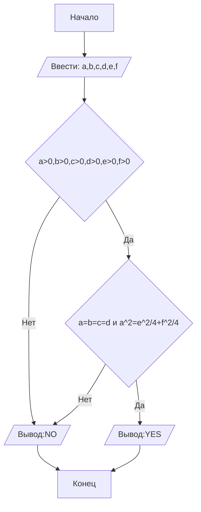

## Cодержание

1. [Отчет по лабораторной работе № N](#отчет-по-лабораторной-работе--n)
2. [Критерии оценивания](#критерии-оценивания)

## Отчет по лабораторной работе № 1

#### № группы: ` ПМ-2401`

#### Выполнил: `Воеводина Дарья Андреевна`

#### Вариант: `5`

### Cодержание:

- [Постановка задачи](#1-постановка-задачи)
- [Входные и выходные данные](#2-входные-и-выходные-данные)
- [Математическая модель](#25-математическая-модель)
- [Выбор структуры данных](#3-выбор-структуры-данных)
- [Алгоритм](#4-алгоритм)
- [Программа](#5-программа)
- [Анализ правильности решения](#6-анализ-правильности-решения)

### 1. Постановка задачи

- Условия задачи

> На вход программы подаются шесть натуральных чисел — все возможные
расстояния между четырьмя точками на плоскости. Определить, являются
ли эти 4 точки вершинами ромба ("YES"/"NO").

- Для выполнения этой задачи, нужно рассмотреть все условия того, что фигура ромб:
  -все стороны равны
  -диагонали точкой пересечения делятся пополам и перпендмкулярны
Нужно рассмотреть выполняются ли эти условия одновременно

### 2. Входные и выходные данные

#### Данные на вход
В задаче указано, что вход подается 6 натуральных чисел, являющихся расстояниями
Максимальная граница не указана. Поэтому возьмём произвольную - 1000.
А минимальные граница всех чисел, таким образом, является число 1
|             | Тип                       | min значение    | max значение   |
|-------------|---------------------------|-----------------|----------------|
|   (Число 1) | Целое(натуральное) число  |        1        |     1000       |
|   (Число 2) | Целое(натуральное) число  |        1        |     1000       |
|   (Число 3) | Целое(натуральное) число  |        1        |     1000       |
|   (Число 4) | Целое(натуральное) число  |        1        |     1000       |
|   (Число 5) | Целое(натуральное) число  |        1        |     1000       |
|   (Число 6) | Целое(натуральное) число  |        1        |     1000       |

#### Данные на выход
На выходе мы получаем ответ на вопрос, являются ли 4 точки вершинами ромба, то есть вывод это строка
|          | Тип                                | Значение   |
|----------|------------------------------------|------------|
| Строка 1 | Строка                             | YES/NO     |

### 2,5. Математическая модель

Свойства ромба: 
1) Все стороны ромба равны (a=b=c=d, где a,b,c,d - стороны ромба)
2) Диагонали ромба перпендикулярны, точкой пересечения делятся пополам(a^2=(e/2)^2+(f/2)^2, где a-сторона ромба, а e,f - его диагонали)


### 3. Выбор структуры данных

Программа получает 6 целых, натуральных чисел
|             | название переменной | Тип (в Java) |
|-------------|---------------------|--------------|
|   (Число 1) | `a`                 |    `int`     |
|   (Число 2) | `b`                 |    `int`     |
|   (Число 3) | `c`                 |    `int`     |
|   (Число 4) | `d`                 |    `int`     |
|   (Число 5) | `e`                 |    `int`     |
|   (Число 6) | `f`                 |    `int`     |
Выходные данные - строка,которую не обязательно хранить в отдельной переменной

### 4. Алгоритм

#### Алгоритм выполнения программы:
1. **Ввод данных**
   Программа считывает шесть целых чисел,обозначенных как 'a','b',''c','d','e','f'
2. **Проверка, на то являются ли введенные числа натуральными**
    Программа, проверяет являются ли числа натуральными, если да, то проверяет условия того, что 4 точки - вершины ромба, иначе выводит  NO
3. **Проверка свойств ромба**
   Программа проверяет, равны ли значаения сторон a,b,c,d, и сумма квадратов полвины диагонали равна этой стороне в квадрате
4. **Вывод результата**
   На экран выводится ответ,являются ли вершины,соединенные данными прямыми вершинами ромба
```markdown
    ```mermaid
         A[Начало] -->B[/Ввести: a,b,c,d,e,f/]
    B --> C{a>0,b>0,c>0,d>0,e>0,f>0}
    C --> |Да| D{a=b=c=d и a^2=e^2/4+f^2/4}
    C --> |Нет| F{a=b=c=d и a^2=e^2/4+f^2/4}
    D --> |Да| E[/Вывод:YES/]
    D --> |Нет| F[/Вывод:NO/]
    F --> G[Конец]
    E --> G[Конец]

    ``` 
```





### 5. Программа

Полный текст программы с комментариями на русском языке

Нужно вставить код прямо в отчет в блок:

```markdown
    ```java
          import java.io.PrintStream;
            import java.util.Scanner;
            public class Main {
            // Объявляем объект класса Scanner для ввода данных
            public static Scanner in = new Scanner(System.in);
            // Объявляем объект класса PrintStream для вывода данных
            public static PrintStream out = System.out;
            
                public static void main(String[] args) {
                    //Считываем шесть целых чисел a,b,c,d,e,f с консоли
                    int a = in.nextInt();
                    int b = in.nextInt();
                    int c = in.nextInt();
                    int d = in.nextInt();
                    int e = in.nextInt();
                    int f = in.nextInt();
                     //Проверяем являются ли числа натуральными
                    if (a>0&&b>0&&c>0&&d>0&&e>0&&f>0) {
                        //Проверяем выполняются ли свойства ромба для введенных чисел
                        if ((a == b && a == c && a == d) && (Math.pow(e / 2, 2) + Math.pow(f / 2, 2) == Math.pow(a, 2))) {
                            //Если все свойства выполняются, то выводим ответ YES
                            out.print("YES");
                        }
                        else {
                            //Если хотя бы одно свойство не выполняется, выводим ответ NO
                            out.print("NO");
                        }
                    }
                    else {
                        //Если введенные числа не являются натуральными,то у нас не моежт быть ромба
                        out.print("NO");
                    }
                }
            }
    ``` 
```

Это будет выглядеть следующим образом:

```java
class Main{
    // Что-то далее
}
```

### 6. Анализ правильности решения

Привести тесты и анализ работы программы для этих тестов.
Очень неплохо было бы обосновать выбор тестов.

1. Тест на правильность работы программы

   - Input:
       ```
     5
     5
     5
     5
     6
     8
    
       ```

- Output:
    ```
   YES
    ```

  2. Тест на что-то еще

     - Input:
         ```
       1
       1
       1
       1
       1
       1
         ```

- Output:
    ```
    NO
    ```
3. Тест на учёт программой, натуральности числа

- Input:
    ```
   -5
   -5
  -5
  -5
  -6
  -8
    ```

- Output:
    ```
    NO
    ```

# Критерии оценивания

Обратите внимание на то, что лабораторная работа должна быть выложена в отдельный репозиторий с названием LabN (N -
Номер лабы). В репозитории должно быть минимум 2 файла (README.md - отчет, Main.java - код лабы)

| **Критерий**                                                                                                                                                                           | **Баллы**       |
|----------------------------------------------------------------------------------------------------------------------------------------------------------------------------------------|-----------------|
| **Корректность программы**                                                                                                                                                             | **0** - **40**  |
| - Программа полностью выполняет задачу                                                                                                                                                 | 15              |
| - Нет ошибок выполнения                                                                                                                                                                | 10              |
| - Учтены все ограничения                                                                                                                                                               | 5               |
| - Правильное поведение в "крайних" случаях                                                                                                                                             | 10              |
|                                                                                                                                                                                        |                 |
| **Оптимизация кода**                                                                                                                                                                   | **0** - **20**  |
| - Эффективные алгоритмы                                                                                                                                                                | 10              |
| - Избежание избыточности и повторов                                                                                                                                                    | 5               |
| - Разумность использования структур данных                                                                                                                                             | 5               |
|                                                                                                                                                                                        |                 |
| **Читабельность и стиль кода**                                                                                                                                                         | **0** - **20**  |
| - Соблюдение стандартов форматирования                                                                                                                                                 | 5               |
| - Наличие комментариев, в полном объеме поясняющих написанный код                                                                                                                      | 10              |
| - Понятные имена переменных и функций                                                                                                                                                  | 5               |
|                                                                                                                                                                                        |                 |
| **Оформление отчета**                                                                                                                                                                  | **0** - **20**  |
| - Соблюдение структуры отчета                                                                                                                                                          | 5               |
| - Отчет загружен на GitHub в репозиторий с названием LabN (N - номер лабораторной работы), отчет в формате Markdown с названием README.md, также есть файл Main.java с кодом программы | Обязательно     |
| - Четкое описание алгоритма (блок-схема если нужна)                                                                                                                                    | 5               |
| - Полнота покрытия тестами всех случаев                                                                                                                                                | 5               |
| - Обоснования использования алгоритма, структур данных                                                                                                                                 | 5               |
|                                                                                                                                                                                        |                 |
| **Общая сумма**                                                                                                                                                                        | **0** - **100** |

